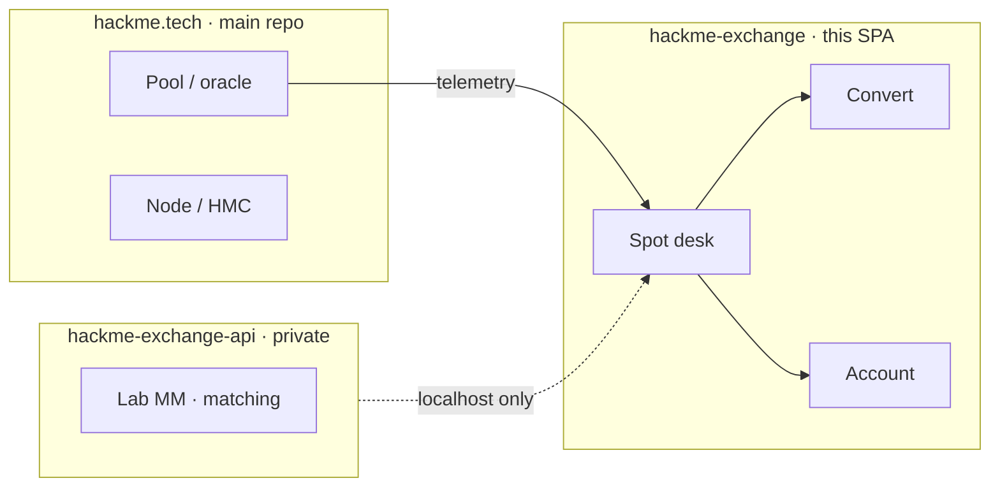

<div align="center">

<pre aria-label="HackMe Exchange ASCII">
██╗  ██╗ █████╗  █████╗ ██╗  ██╗███╗   ███╗███████╗    ███████╗██╗  ██╗
██║  ██║██╔══██╗██╔════╝██║ ██╔╝████╗ ████║██╔════╝    ██╔════╝╚██╗██╔╝
███████║███████║██║     █████╔╝ ██╔████╔██║█████╗      █████╗   ╚███╔╝
██╔══██║██╔══██║██║     ██╔═██╗ ██║╚██╔╝██║██╔══╝      ██╔══╝   ██╔██╗
██║  ██║██║  ██║╚██████╗██║  ██╗██║ ╚═╝ ██║███████╗    ███████╗██╔╝ ██╗
╚═╝  ╚═╝╚═╝  ╚═╝ ╚═════╝╚═╝  ╚═╝╚═╝     ╚═╝╚══════╝    ╚══════╝╚═╝  ╚═╝
</pre>

# HackMe Exchange

### Paper Spot · Convert · Account · Pool — private lab terminal for the HackMe ecosystem

**Own HMC market desk** — operator reference mids, pool telemetry, VIP fees. Soft D0 = paper UI only (no public matching API).

<br/>

[](STATUS.md)
[](docs/D0_CHECKLIST.md)
[](package.json)
[](https://github.com/jokeez/hackme-exchange-api)
[](LICENSE)
[](docs/ECONOMICS.md)
[](https://hackme.tech)

<br/>

**[🏠 Main HackMe repo](https://github.com/jokeez/hackme)** · **[📖 STATUS](STATUS.md)** · **[⚡ Quick start](#quick-start)** · **[💰 Economics](docs/ECONOMICS.md)** · **[🔐 Security](docs/SECURITY.md)** · **[📚 Docs](docs/README.md)** · **[🔌 Lab API](https://github.com/jokeez/hackme-exchange-api)**

<br/>

| | |
|:---:|:---|
| **Parent network** | [github.com/jokeez/hackme](https://github.com/jokeez/hackme) · [hackme.tech](https://hackme.tech) |
| **This SPA** | [github.com/jokeez/hackme-exchange](https://github.com/jokeez/hackme-exchange) |
| **Lab matching API** | [github.com/jokeez/hackme-exchange-api](https://github.com/jokeez/hackme-exchange-api) |
| **Soft target** | `exchange.hackme.tech` · **D0 Paper · 2026-09-15** |

</div>

---

## Why this repo

HackMe’s pool and chain live in the **[main HackMe repository](https://github.com/jokeez/hackme)**. This sidecar is the **spot terminal**: charts, book, convert, paper wallet — so the network can show an own-market desk without merging SPA code into the hub monorepo.

| Pillar | What you get |
|--------|----------------|
| **📈 Spot** | Book · chart · market / limit / stop / OCO · VIP fees · pay-fees-in-HMC |
| **⇄ Convert** | Paper or lab seed mid · inventory-aware when API connected |
| **👤 Account** | Balances · VIP · lab mint / bridge · withdraw **request** (complete = CLI) |
| **⛏ Pool** | Read-only oracle telemetry from [hackme.tech](https://hackme.tech) |



> **Fair messaging:** own HMC market — **not** a third-party listing claim.  
> Soft D0 = **paper only**. Live deposits after custody gates. Details: [STATUS.md](STATUS.md).

---

## Modes

| Mode | Meaning |
|------|---------|
| **paper** (default) | localStorage wallet · reference mids — **not** real custody |
| **lab** | Loopback [exchange-api](https://github.com/jokeez/hackme-exchange-api) — still **not** public |
| **live** | **Blocked** until an explicit public go-live |

Never put admin tokens in `VITE_*` — Vite inlines them into the browser bundle.

---

## Pricing (paper / soft)

| Pair / leg | Reference | Notes |
|------------|-----------|-------|
| **HMC/USDT** | **0.05** | ±0.35% paper drift · **not** scaled by pool GH |
| **SUP/USDT** | **0.01** | Same |
| **HMC/SUP** | **5.0** | Cross = HMC ÷ SUP |
| **HMC/BTC · SUP/BTC** | `usdt / btcUsd` | Live BTCUSDT when CSP allows · else fallback |

Canonical sheet: [`docs/ECONOMICS.md`](docs/ECONOMICS.md).

---

## Quick start

```bash
cp .env.example .env   # optional
npm install
npm test
npm run build
npm run dev            # → http://127.0.0.1:5199
```

### Optional private lab API

```bash
# Terminal A — sibling API repo
cd ../hackme-exchange-api && go run ./cmd/exchange-api
# → http://127.0.0.1:18443/health

# Terminal B — .env: VITE_LAB_API=1  VITE_EXCHANGE_API_ORIGIN=http://127.0.0.1:18443
npm run dev
```

Wiring: [`docs/LAB_API.md`](docs/LAB_API.md)

---

## QA (current)

| Gate | Command / note |
|------|----------------|
| Unit + security | `npm test` → **700 PASS** |
| Full UI/UX | `node scripts/full_ui_ux_pass.mjs` |
| Visual / mobile | `node scripts/g10_visual_pass.mjs` |
| Chart pairs | `node scripts/b_chart_manual_pass.mjs` |
| D0 static tarball | `bash scripts/prepare_d0_static.sh` (gitignored) |
| API pre-public | sibling `bash scripts/pre_public_dry_run.sh` → public **HOLD** |

---

## Docs

| Doc | Purpose |
|-----|---------|
| [`STATUS.md`](STATUS.md) | Soft / live ladder · messaging |
| [`docs/README.md`](docs/README.md) | Full docs index |
| [`docs/D0_CHECKLIST.md`](docs/D0_CHECKLIST.md) | Sep 10 go/no-go |
| [`docs/SCOPE.md`](docs/SCOPE.md) | Boundaries vs HackMe hub |
| [`docs/LAB_API.md`](docs/LAB_API.md) | SPA ↔ loopback API |
| [`docs/ECONOMICS.md`](docs/ECONOMICS.md) | Fees · VIP · reference mids |
| [`docs/SECURITY.md`](docs/SECURITY.md) | SPA threat checklist |
| [`CONTRIBUTING.md`](CONTRIBUTING.md) | Setup · PRs · secrets |

Canonical **API** security / hosting / pre-public:  
[hackme-exchange-api/docs](https://github.com/jokeez/hackme-exchange-api/tree/main/docs)

---

## Related

| Project | Link |
|---------|------|
| **HackMe Network (main)** | [github.com/jokeez/hackme](https://github.com/jokeez/hackme) |
| **Site / pool** | [hackme.tech](https://hackme.tech) |
| **Exchange API** | [github.com/jokeez/hackme-exchange-api](https://github.com/jokeez/hackme-exchange-api) |

---

## License

[GNU Affero General Public License v3.0](LICENSE) — same family as the [main HackMe](https://github.com/jokeez/hackme) network.

Paper / private-lab tooling only. **Not** a licensed exchange · **not** production custody.

<sub>Copyright © 2026 HackMe contributors · <a href="LICENSE">AGPL-3.0</a></sub>
